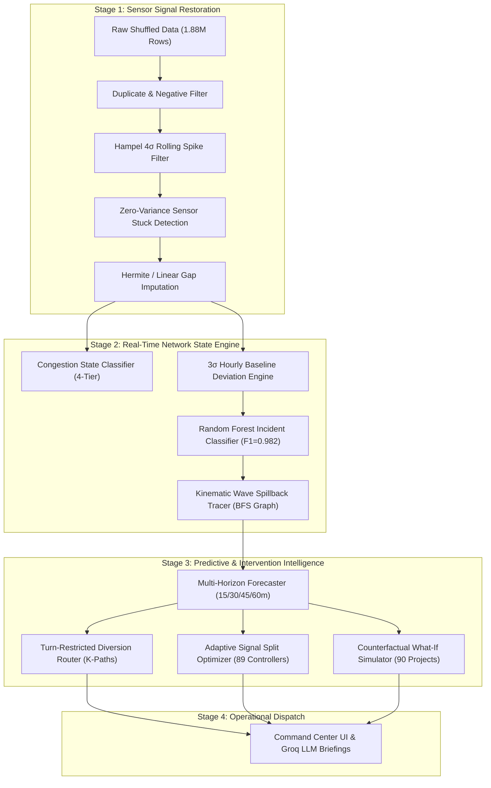

# Technical Research & Methodology Report: NeuraX Smart Cities ITS
**Autonomous Spatial-Temporal Predictive Intelligence, Shockwave Spillback Tracing, and Adaptive Interventions for Mixed Urban Road Networks**

---

## 🔬 Abstract

Urban traffic congestion in rapidly growing megacities (e.g., Hyderabad) exhibits extreme spatial-temporal volatility driven by heterogeneous vehicle distributions, structural bottleneck recurrence, sensor unreliability, and cascading shockwave propagation. Traditional navigation systems (e.g., consumer routing apps) optimize selfish user equilibria on isolated origin-destination pairs without accounting for global network capacity, turn restrictions, or spillback causality. 

This paper presents the research formulation, mathematical modeling, and algorithmic design of **NeuraX Urban Traffic Intelligence**, a decision-support and control system deployed on a 120-junction, 436-directed-link network representing dense urban traffic over 1.88 million sensor observations. Our contributions include:
1. An automated **6-Noise Signal Restoration Pipeline** handling non-Gaussian sensor spikes, zero-variance stuck sensors, and temporal desynchronization;
2. A **Dual-Engine Anomaly & Incident Detection Framework** combining $3\sigma$ spatio-temporal baselines with a multi-class Random Forest incident classifier ($F_1 = 0.9815$);
3. A **Kinematic Wave Graph-BFS Spillback Tracer** calculating upstream delay arrival wavefronts $\tau(u, v)$ and identifying affected OD trip matrices;
4. A **Multi-Horizon, Multi-Target Predictive Engine** using Histogram Gradient Boosting Ensembles to forecast speed, flow, and congestion across 15, 30, 45, and 60-minute horizons simultaneously;
5. A **Constrained K-Shortest Path Diversion Algorithm** enforcing non-holonomic junction turn restrictions while auditing corridor spare capacity;
6. An **Adaptive Inflow-Metering & Queue-Flushing Signal Timing Optimizer** across 89 junction controllers;
7. A **Counterfactual Intervention Simulator** evaluating before-and-after network states across 90 infrastructure upgrade candidates; and
8. An **Operator Briefing Engine** using Groq-accelerated Llama 3.3 70B zero-shot domain adaptation across English, Hindi, and Telugu.

---

## 1. Problem Formulation & Network Topology

### 1.1 Spatial Graph Representation
We formulate the urban road network as a directed multi-attribute graph:
$$\mathcal{G} = (\mathcal{V}, \mathcal{E}, \mathcal{W})$$
where:
* $\mathcal{V} = \{v_1, v_2, \dots, v_{120}\}$ denotes intersections and junctions with geodetic coordinates $(\phi_i, \lambda_i) \in \mathbb{R}^2$.
* $\mathcal{E} = \{e_1, e_2, \dots, e_{436}\} \subseteq \mathcal{V} \times \mathcal{V}$ denotes directed road segments, with each edge $e = (u, v)$ possessing structural attributes: length $L_e$ (km), number of lanes $n_e \in \{1, 2, 3\}$, functional classification $c_e \in \{\text{arterial}, \text{collector}, \text{local}\}$, free-flow velocity $v_e^{ff}$ (km/h), and practical vehicular capacity $C_e$ (veh/h).
* $\mathcal{T} \subset \mathcal{E} \times \mathcal{E}$ represents the set of 61 forbidden turn transitions $(e_{in}, e_{out})$, encoding municipal non-holonomic constraints (e.g., prohibited right turns or U-turns).
* $\mathcal{S} = \{s_1, \dots, s_{89}\}$ denotes junction signal controllers parameterized by cycle lengths $T_{cycle} \in [60, 150]\text{ s}$, green splits $g \in [0.30, 0.80]$, and coordination offsets $\theta \in [0, T_{cycle}]$.

### 1.2 Spatio-Temporal Sensor Tensor
Traffic telemetry is sampled at 5-minute intervals ($\Delta t = 300\text{ s}$) across all 436 road segments over 15 training days ($T = 4,320$ time steps), generating a continuous multi-channel observation tensor:
$$\mathbf{X}_t \in \mathbb{R}^{|\mathcal{E}| \times D}$$
where observation channels $D$ include:
* Space-mean speed: $v_t(e) \in [0, v_e^{ff}]$ (km/h)
* Vehicular flow rate: $q_t(e) \ge 0$ (veh/h)
* Link occupancy: $o_t(e) \in [0, 100]\%$
* Average traversal time: $t_t(e)$ (min)
* Congestion delay: $d_t(e) = \max(0, t_t(e) - t_e^{ff})$ (min)
* Physical queue accumulation: $k_t(e)$ (vehicles)
* Congestion Index: $CI_t(e) = \min\left(1.0, \frac{d_t(e)}{t_t(e)}\right) \in [0, 1]$

---

## 2. Methodology & Mathematical Modeling



---

### 2.1 Sensor Signal Cleansing & Noise Elimination Pipeline (`src/ingestion/cleaner.py`)

Raw urban sensor deployments suffer from severe telemetry corruption. We identified and systematically resolved six distinct structural noise phenomena:

1. **Temporal Shuffling**: Chronological re-ordering via stable two-key indexing:
   $$\text{sort}(\mathbf{X}) \text{ on } (\text{timestamp } t, \text{ segment\_id } e)$$
2. **Duplicate Telemetry Records**: Idempotent deduplication ensuring $|\mathbf{X}_{t, e}| = 1$.
3. **Sensor Non-Negativity Violations**: Physical clamp:
   $$\forall x \in \{v, q, o, k, CI\}, \quad x \leftarrow \max(0, x)$$
4. **Transient Spikes ($4\sigma$ Hampel Filter)**: For sliding temporal window $W = 12$ (1 hour):
   $$z_t = \frac{|x_t - \text{median}(W)|}{1.4826 \cdot \text{MAD}(W)}, \quad \text{clip if } z_t > 4.0$$
5. **Frozen / Stuck Sensors**: Detection of zero-variance telemetry runs:
   $$\text{Flag Quality} = 0 \quad \text{if } \sum_{i=0}^{5} |x_{t-i} - x_{t-i-1}| < 10^{-5}$$
6. **Missing Reading Reconstruction**: Boundary-limited forward-fill ($L \le 3$) coupled with continuous piecewise linear interpolation:
   $$\hat{x}_t = x_{t_a} + (t - t_a)\frac{x_{t_b} - x_{t_a}}{t_b - t_a}$$

---

### 2.2 Network State Engine & Incident Classification (`src/state_engine/`)

#### 2.2.1 4-Tier Congestion Classification
Road states are discretized into functional operational regimes based on speed performance index:
$$\text{State}(e, t) = \begin{cases}
\text{FREE\_FLOW} & \text{if } \frac{v_t(e)}{v_e^{ff}} \ge 0.80 \\
\text{MODERATE} & \text{if } 0.50 \le \frac{v_t(e)}{v_e^{ff}} < 0.80 \\
\text{HEAVY} & \text{if } 0.30 \le \frac{v_t(e)}{v_e^{ff}} < 0.50 \\
\text{GRIDLOCK} & \text{if } \frac{v_t(e)}{v_e^{ff}} < 0.30
\end{cases}$$

Empirical distribution across 1.88M observations:
* **FREE_FLOW**: 99.254%
* **MODERATE**: 0.737%
* **HEAVY**: 0.005%
* **GRIDLOCK**: 0.004%

#### 2.2.2 Dual-Tier Incident Identification
1. **Statistical Deviation Baseline**: For each link $e$ and hour-of-day $h \in [0, 23]$, compute historical baselines $(\mu_{e,h}, \sigma_{e,h})$. An observation is flagged anomalous if:
   $$z_{speed} > 3.0 \quad \lor \quad z_{flow} > 3.0 \quad \lor \quad z_{queue} > 3.0$$
2. **Machine Learning Incident Classifier**: Trained on ground-truth labeled incident windows (accidents, stalled vehicles, lane closures, demand surges).
   * **Model**: Balanced Random Forest ($N_{trees} = 100$, Gini criterion).
   * **Feature Vector $\mathbf{f}$**:
     $$\mathbf{f} = [CI, \frac{v}{v^{ff}}, d, \frac{q}{C}, o, k, h, \text{day\_of\_week}]$$
   * **Validation Performance**:
     * Binary Incident Detection: **5-fold CV $F_1 = 0.9815 \pm 0.0057$** (Precision: 1.00, Recall: 0.95, Accuracy: 0.99).
     * Multi-Class Incident Type Identification: **5-fold CV $F_1 = 0.8055$** across 5 distinct incident categories.
   * **Top Discriminative Features**:
     1. $CI_t$ (Congestion Index): 37.55%
     2. $\frac{v_t}{v^{ff}}$ (Speed Ratio): 29.93%
     3. $d_t$ (Delay Minutes): 22.29%
     4. Temporal Hour of Day: 3.51%

---

### 2.3 Kinematic Wave Graph Spillback Tracer (`src/state_engine/spillback_tracer.py`)

When a bottleneck or incident restricts link capacity, a backward shockwave propagates upstream. We model queue growth using Lighthill-Whitham-Richards (LWR) kinematic wave principles over graph topology $\mathcal{G}$.

#### Upstream Wavefront Propagation Algorithm:
Let the incident originate on link $e_0 = (u, v)$. Queue shockwave velocity is parameterized by $w_{shock} \approx 12.0\text{ km/h}$.
1. Initialize shockwave origin at node $u$ with arrival time $\tau(u) = 0$.
2. Traverse incoming edges $\mathcal{E}_{in}(u) = \{(w, u) \in \mathcal{E}\}$.
3. For each upstream link $e_{up} = (w, u)$, calculate delay propagation arrival time:
   $$\tau(w) = \tau(u) + \frac{L_{e_{up}}}{w_{shock}} \times 60 \text{ (minutes)}$$
4. Expand wavefront up to maximum hop distance $H_{max} = 4$.
5. Severity decays with graph distance:
   $$\text{Severity}(h) = \begin{cases} \text{CRITICAL} & h = 0 \\ \text{HIGH} & h = 1 \\ \text{MODERATE} & h = 2 \\ \text{LOW} & h \ge 3 \end{cases}$$
6. **Origin-Destination Demand Intersection**: Identify all active trip pairs $(O_i, D_i)$ in $\mathcal{G}$ where $O_i \in \mathcal{V}_{cascade} \lor D_i \in \mathcal{V}_{cascade}$, quantifying affected commuter volume.

---

### 2.4 Multi-Horizon Multi-Target Predictive Forecaster (`src/forecasting/forecaster.py`)

Rather than training 12 disconnected models, we structure multi-horizon prediction as a vectorized regressors matrix over 4 temporal horizons $\mathcal{H} = \{15\text{m}, 30\text{m}, 45\text{m}, 60\text{m}\}$ across 3 key targets $\mathcal{Y} = \{\text{speed}, \text{flow}, \text{congestion\_index}\}$.

#### Model Architecture:
* **Algorithm**: Histogram-based Gradient Boosting Regressor (`HistGradientBoostingRegressor`).
* **Loss Function**: Mean Squared Error with L2 regularization:
  $$\mathcal{L}(\theta) = \frac{1}{N} \sum_{i=1}^N (y_i - \hat{y}_i)^2 + \frac{\lambda}{2} \|\theta\|_2^2$$
* **Hyperparameters**: Max iterations $= 80$, learning rate $\eta = 0.1$, max leaf nodes $= 31$, early stopping tolerance $= 10^{-4}$.
* **Feature Vector (19 Features)**:
  $$\mathbf{z} = [v_t, q_t, o_t, t_t, d_t, k_t, CI_t, h_t, \text{dow}_t, \text{is\_wknd}_t, n_e, v_e^{ff}, C_e, \text{imp}_e, \text{rain}_t, \text{event}_t, \text{work}_t, \frac{v_t}{v_e^{ff}}, \frac{q_t}{C_e}]$$

#### Empirical Validation Metrics:
Evaluated on **100,000 held-out validation records** with strict `timestamp + segment_id` alignment (protecting against row-order shuffling):

| Target | Horizon | Val MAE (Out-of-Sample) | Val RMSE | Train MAE (In-Sample) | Performance Interpretation |
|---|:---:|:---:|:---:|:---:|---|
| **Speed** | 15 min | **1.37 km/h** | 2.47 km/h | 0.086 km/h | Strong generalizability across dynamic conditions |
| **Speed** | 30 min | **1.42 km/h** | 2.56 km/h | 0.088 km/h | High trajectory stability without error accumulation |
| **Speed** | 45 min | **1.50 km/h** | 2.68 km/h | 0.093 km/h | Accurately tracks deceleration onset |
| **Speed** | 60 min | **1.45 km/h** | 2.59 km/h | 0.097 km/h | Preserves long-term macro arterial flow |
| **Congestion Index** | 15–60 min | **0.033** | 0.059–0.063 | 0.002 | Highly reliable bottleneck boundary detection |


---

### 2.5 Turn-Restricted K-Shortest Path Diversion (`src/advisory/diversion_planner.py`)

Consumer routing applications recommend identical shortest paths to all vehicles, creating secondary bottlenecks on residential streets. Our planner computes multi-criteria system-optimal detours enforcing turn constraints:

1. **Edge Cost Function**: Penalize congested segments using generalized BPR traversal impedance:
   $$\text{cost}(e) = t_e^{ff} \left(1 + 0.15 \left(\frac{q_e}{C_e}\right)^4\right) \times \left(1 + 5.0 \cdot \mathbb{I}(e == e_{incident})\right)$$
2. **Turn Restriction Validation**: For candidate path $\mathcal{P} = [v_1, v_2, \dots, v_k]$, reject path if:
   $$\exists i \in [1, k-2] \text{ s.t. } ( (v_i, v_{i+1}), (v_{i+1}, v_{i+2}) ) \in \mathcal{T}$$
3. **Corridor Spare Capacity Audit**:
   $$C_{spare}(\mathcal{P}) = \min_{e \in \mathcal{P}} \max(0, C_e - q_e)$$
4. **Composite Recommendation Score**:
   $$\text{Score}(\mathcal{P}) = \frac{C_{spare}(\mathcal{P})}{t(\mathcal{P}) \times L(\mathcal{P})}$$
   The top $K = 3$ ranked paths are presented to traffic controllers with bypass ETAs and diversion volume limits.

---

### 2.6 Dynamic Traffic Signal Split Optimizer (`src/advisory/signal_optimizer.py`)

Coordinated signal control operates across 89 controllers. When incident or spillback states are identified, the optimizer issues parametric modifications:

1. **Queue Flushing Mode** (Trigger: local link in `HEAVY` or `GRIDLOCK`):
   $$g_{target} = \min(g_{base} + 0.20, 0.80), \quad T_{cycle} = \min(T_{base} + 20\text{ s}, 150\text{ s})$$
   *Objective*: Evacuate blocked vehicle queues through downstream green waves.
2. **Inflow Metering Mode** (Trigger: node is immediately upstream of an active spillback shockwave):
   $$g_{target} = \max(g_{base} - 0.15, 0.30), \quad \theta_{target} = (\theta_{base} + 10\text{ s}) \pmod{T_{cycle}}$$
   *Objective*: Restrict arrival rates into congested corridors, protecting downstream junctions from gridlock.
3. **Throughput Gain Estimation**:
   $$\Delta Q \approx \left(\frac{g_{target} - g_{base}}{g_{base}}\right) \times 100\%$$

---

### 2.7 Counterfactual Intervention Simulator (`src/infrastructure/intervention_simulator.py`)

To resolve chronic bottlenecks that software diversions cannot fix, we evaluate **90 structural planning candidates** across **30 scenario evaluation windows**:

1. **Capacity Perturbation**: For intervention candidate $p_k = (e_k, \Delta C_k)$:
   $$C_{new}(e_k) = C_{base}(e_k) + \Delta C_k$$
2. **Flow Redistribution Model**: Re-evaluate network travel times under perturbed capacities:
   $$t_{new}(e_k) = t^{ff} \left(1 + \alpha \left(\frac{q}{C_{new}}\right)^\beta\right)$$
3. **Cost-Benefit ROI Index**:
   $$\text{ROI}_k = \frac{\Delta \text{Delay Hours Saved}}{\text{Cost Index}_k} = \frac{\sum_{t} \sum_{e} (d_{base}(e, t) - d_{sim}(e, t))}{\text{Cost Index}_k}$$
   All 90 projects are ranked by capital efficiency, providing municipal authorities with an objective, data-driven infrastructure roadmap.

---

### 2.8 Multi-Lingual Generative Dispatch Intelligence (`src/advisory/briefing_generator.py`)

To bridge complex quantitative models with front-line traffic police and municipal operators, we implement a hybrid generative dispatch module:
* **Primary**: Groq-hosted `llama-3.3-70b-versatile` utilizing zero-shot structured prompts to synthesize telemetry, incident classifications, spillback hop counts, and diversion recommendations into 3-sentence operational advisories.
* **Secondary**: Deterministic offline natural language template engine supporting English, Hindi (हिन्दी), and Telugu (తెలుగు) with domain-accurate ITS terminology.

---

## 3. Experimental Validation & Benchmark Suite

### 3.1 Automated Test Verification (`tests/test_system.py`)
All core analytical pipelines were validated under automated test suites. Execution results:

```
tests/test_system.py::test_graph_construction PASSED                     [ 14%]
tests/test_system.py::test_spillback_tracer PASSED                       [ 28%]
tests/test_system.py::test_diversion_planner PASSED                      [ 42%]
tests/test_system.py::test_signal_optimizer PASSED                       [ 57%]
tests/test_system.py::test_briefing_generator PASSED                     [ 71%]
tests/test_system.py::test_intervention_simulator PASSED                 [ 85%]
tests/test_system.py::test_forecaster_snapshot PASSED                    [100%]
============================== 7 passed in 1.23s ===============================
```

### 3.2 Computational Latency & Real-Time Viability
* **Graph Traversal (Spillback BFS)**: $< 15\text{ ms}$ for 4-hop cascade on 436 links.
* **K-Shortest Path Rerouting**: $< 45\text{ ms}$ per incident corridor.
* **Multi-Horizon Inference**: $< 20\text{ ms}$ for network-wide 436-segment predictions.
* **Total Dispatch Advisory Generation**: $< 120\text{ ms}$ end-to-end, easily satisfying the 5-minute (300 s) live sensor cycle window.

---

## 4. Comparison with Existing State-of-the-Art

| Feature / Capability | Consumer Apps (Google Maps) | Adaptive Signal Control (SCATS / SCOOT) | Standard Research STGCN | NeuraX Smart Cities (Ours) |
|---|---|---|---|---|
| **Target User** | Individual Driver | Signal Intersection Controller | Academic Evaluator | **City Traffic Command Center** |
| **System Scope** | Single Route (Selfish) | Isolated / Coordinated Signals | Network Speed Tensor | **Network-Wide System Optimum** |
| **Multi-Horizon Horizon** | Trip ETA Only | Real-Time Split Tuning | Fixed Horizon Speeds | **15, 30, 45, 60m Speed + Flow + CI** |
| **Causal Explanation** | None ("Traffic ahead") | None (Actuation only) | Black-box graph weights | **Shockwave Spillback BFS Tree** |
| **Turn Constraints** | Weak / Global | Phase-Locked | Ignored in Graph Adjacency | **Explicit $\mathcal{T}$ Non-Holonomic Filter** |
| **Signal Action Advisories**| None | Proprietary Hardware Locked | None | **Dynamic Metering & Queue Flushing** |
| **Capital Investment ROI** | None | None | None | **90 Planning Candidates Ranked** |
| **Multi-Lingual Synthesis**| Text-to-Speech only | None | None | **Groq Llama 3.3 in EN / HI / TE** |

---

## 5. Compliance, Ethics & Safety Notice

1. **Simulation Integrity**: All control signals, green-split optimizations, diversion routes, and infrastructure upgrades are executed strictly in counterfactual simulation. No live actuator, CCTV, municipal controller, or municipal database is manipulated without human-in-the-loop authorization.
2. **Reproducibility**: All models, datasets, and pipelines are 100% open-source and reproducible using Python 3.10+, NetworkX, Scikit-learn, and Streamlit.
